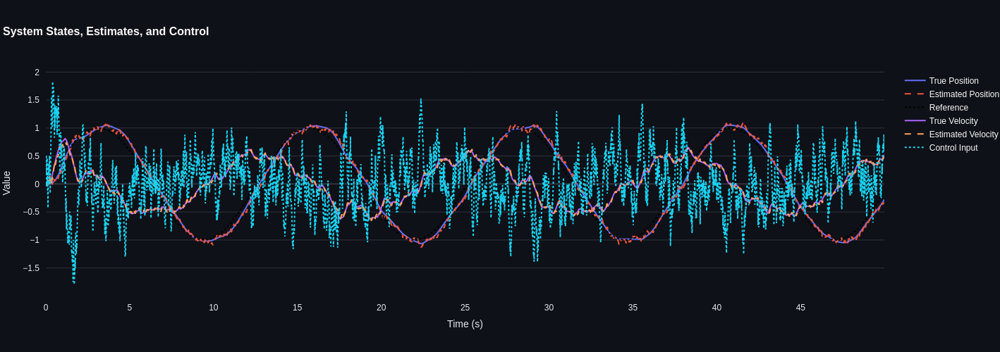
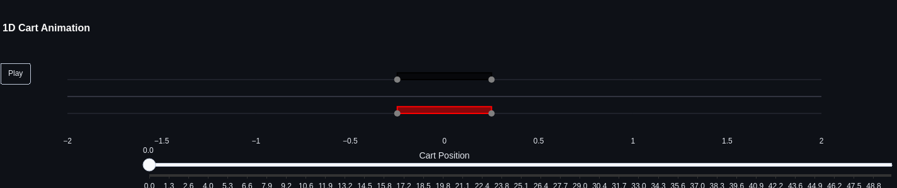

# 🛒 1D Cart Simulation and Control with Kalman Filtering

A real-time simulation and visualization tool for a 1D cart system with state estimation and feedback control, implemented using Python, Plotly, and Streamlit.

---

## 🎯 Overview

This interactive app simulates a mass-on-a-track system (cart) subject to a control force. The cart's position is estimated using a Kalman filter, and controlled via either LQR or PID. The app includes live plotting and animation of the cart behavior in response to a dynamic reference trajectory.

---

## 🚀 Features

- ✅ Discrete-time **Kalman Filter** for position and velocity estimation  
- ✅ **LQR** and **PID** controllers (selectable)  
- ✅ Adjustable **sampling time (`dt`)**  
- ✅ Plotly-based **2-tab interface**:
  - 📈 Simulation results (position, velocity, control)
  - 🎥 Cart animation (with reference and real cart, wheels and all!)  
- ✅ Custom reference trajectories (e.g., sinusoidal)
- ✅ White background and interactive slider for simulation speed

---

## 🗂 Project Structure

```
project/
│
├── main.py                 ← Streamlit entry point
└── src/
    ├── cart.py             ← Cart dynamics, RK4 integration, Kalman filter
    ├── controllers.py      ← LQR and PID controllers
    ├── __init__.py
    └── __pycache__/        ← Compiled bytecode (ignored in version control)
```

---

## 📦 Requirements

Install with [Poetry](https://python-poetry.org/):

```bash
poetry install
```

Or manually:

```bash
pip install streamlit plotly numpy
```

---

## 🧪 Run the App

Launch the simulation:

```bash
poetry run streamlit run main.py
```

---

## 🧠 How It Works

### 🌀 Dynamics

- State: $x = [\text{position};\ \text{velocity}]$
- Discretized using RK4 integration
- Friction modeled as $F = -\mu v$

### 🧮 Estimation

- Only **noisy position** is measured
- Kalman filter estimates full state

### 🎮 Control

- `PID` acts on position error
- `LQR` uses feedback gains for full state

---

## 🖼 Preview

| 📈 State & Control Plots | 🎥 Cart Animation |
|--------------------------|------------------|
|  |  |

---

## 🧭 Future work

- Add support for **external reference signals**
- Export simulation data as **CSV**
- Add **MPC** or **robust control**
- Visualize **Kalman covariance ellipses**

---

## 📄 License

MIT License.  
© 2025 El inge de Control

---
